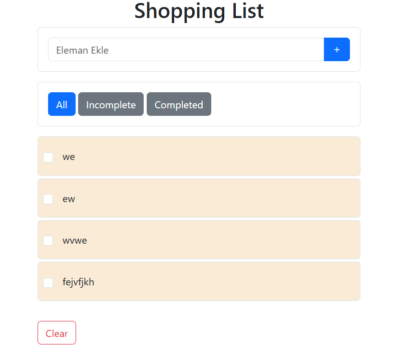

# 📝 Alışveriş / TODO Listesi Uygulaması

Bu proje, temel HTML, CSS ve JavaScript kullanılarak yapılmış bir **alışveriş listesi (shopping list)** uygulamasıdır. Kullanıcılar ürün ekleyebilir, silebilir, tamamlandı olarak işaretleyebilir ve filtreleyebilir.

## 🚀 Özellikler

- 🆕 Yeni ürün ekleme
- ❌ Ürün silme
- ✅ Ürünlere "tamamlandı" (tik atma) özelliği
- 🔍 Filtreleme:
  - Tamamlananları göster
  - Tamamlanmamışları göster
- 🧹 Tüm listeyi temizleme

## 🛠️ Kullanılan Teknolojiler

- HTML5
- CSS3
- JavaScript

## ✍️ Geliştirici

> Bu proje, pratik amaçlı olarak geliştirilmiştir. Sadık Turan, Kodluyoruz gibi kaynaklardan esinlenilmişdir

## 🖼️ Görseller

🔗 **Canlı Demo:**  
👉 [Siteyi Görüntüle](https://682b3b18d49baf187156f552--silver-kulfi-80da68.netlify.app/)
